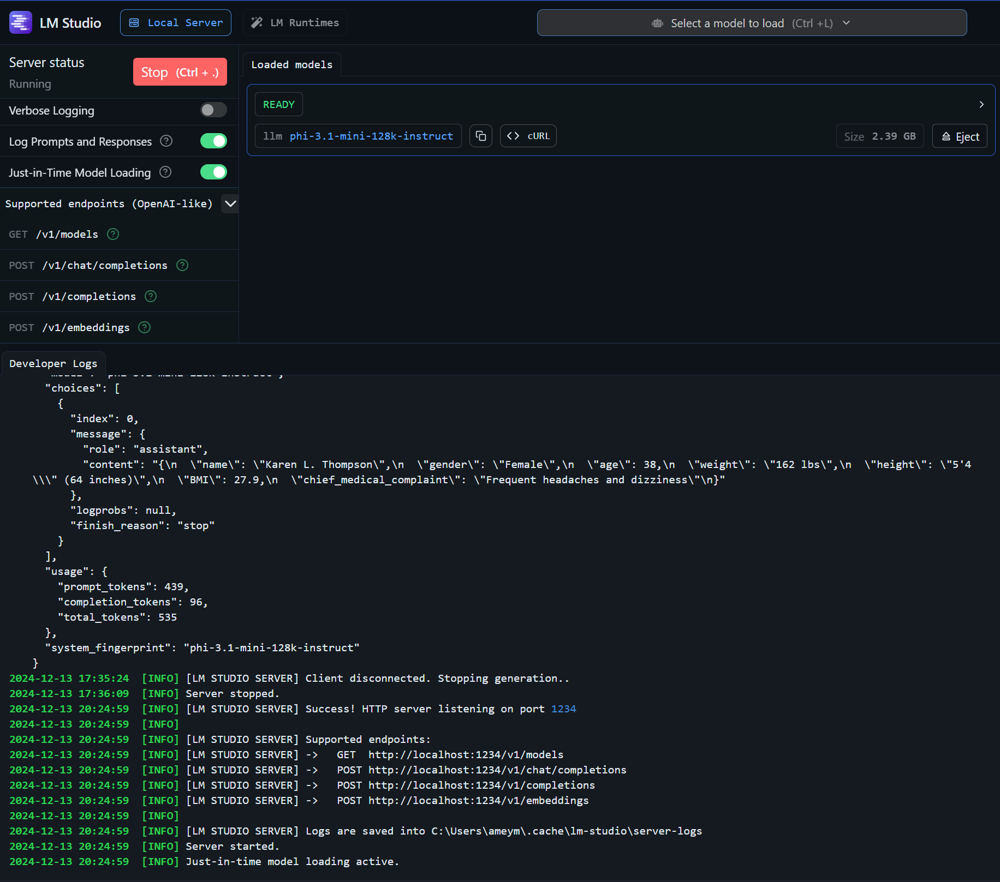
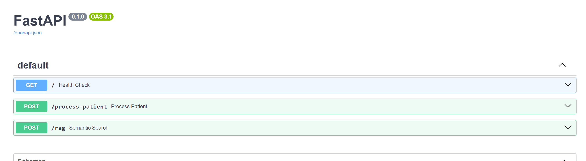
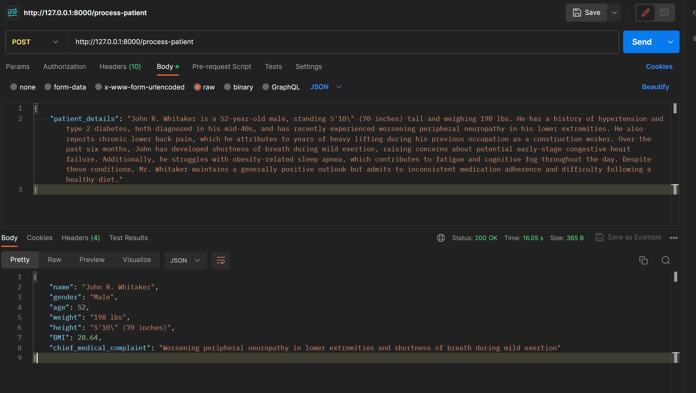
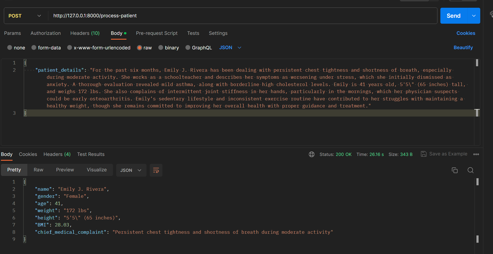
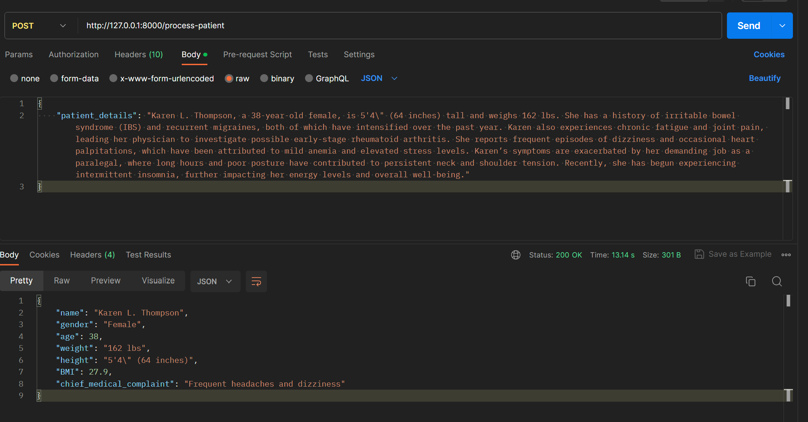
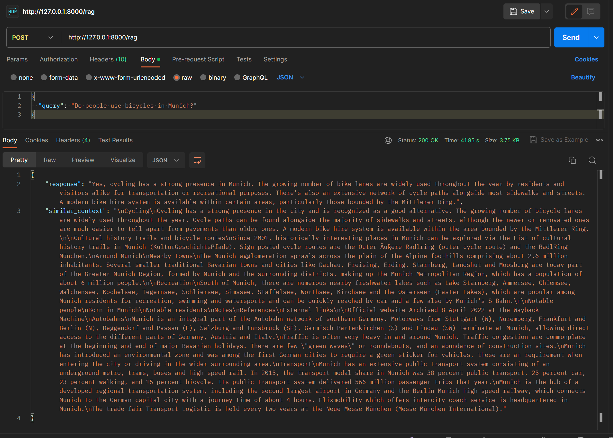

# NLP-assesment

## Overview

This project is an NLP assessment developed for showcasing the use of a FastAPI-based application that leverages a language model (LLM) to perform two main tasks:
1. **Entity Extraction**: Extracts specific medical entities from patient data.
2. **Semantic Similarity**: Performs retrieval-augmented generation (RAG) using semantic similarity on a Wikipedia article.

## Features

- **Entity Extraction**: Extracts name, gender, age, weight, height, BMI, and chief medical complaint from patient details.
- **Semantic Similarity**: Fetches the Wikipedia article of Munich, chunks it, and stores the chunks in a FAISS index for semantic similarity queries.

## Setup Instructions

1. **Clone the Repository**:
   ```bash
   git clone https://github.com/ameympatil/NLP-assesment
   cd NLP-assesment
   ```

2. **Install Dependencies**:
   ```bash
   pip install -r requirements.txt
   ```

3. **Configure the LLM**:
   - Ensure LMStudio is running on your local machine.
   - Use the quantized version of the "phi-3.1-mini-128k-instruct" model.



4. **Run the Application**:
   ```bash
   uvicorn main:app --host 0.0.0.0 --port 8000
   ```

5. **Access the API**:
   - Open your browser and navigate to `http://localhost:8000/docs` to access the Swagger UI for API documentation and testing.



## Usage

### Entity Extraction

- **Endpoint**: `/process-patient`
- **Method**: POST
- **Request Body**:
  ```json
  {
    "patient_details": "Patient details in free text"
  }
  ```
- **Response**: JSON object with extracted medical entities.

## Example Patients

1. **Patient 1**:
   - Name: John R. Whitaker
   - Gender: Male
   - Age: 52
   - Weight: 198 lbs
   - Height: 5'10" (70 inches)
   - BMI: 28.64
   - Chief Medical Complaint: Worsening peripheral neuropathy in lower extremities and shortness of breath during mild exertion



2. **Patient 2**:
   - Name: Emily J. Rivera
   - Gender: Female
   - Age: 41
   - Weight: 172 lbs
   - Height: 5'5" (65 inches)
   - BMI: 28.03
   - Chief Medical Complaint: Persistent chest tightness and shortness of breadth during moderate activity



3. **Patient 3**:
   - Name: Karen L. Thompson
   - Gender: Female
   - Age: 38
   - Weight: 162 lbs
   - Height: 5'4" (64 inches)
   - BMI: 27.9
   - Chief Medical Complaint: Frequent headaches and dizziness



### Semantic Similarity

- **Endpoint**: `/rag`
- **Method**: POST
- **Request Body**:
  ```json
  {
    "query": "Your query here"
  }
  ```
- **Response**: JSON object with the generated response and similar context.



## Pre-run Results

- **Entity Extraction**: The application successfully extracts the required fields from the provided patient details.
- **Semantic Similarity**: The application retrieves relevant context from the Munich Wikipedia article and generates appropriate responses.

## Notes

- The application is designed to run on a local machine without a GPU, though performance may vary.
- Ensure that the LLM is properly configured and running before starting the FastAPI application.

## Troubleshooting

- If you encounter issues with the LLM, verify that LMStudio is running and the model is correctly loaded.
- For API-related issues, check the FastAPI logs for error messages and ensure all dependencies are installed.